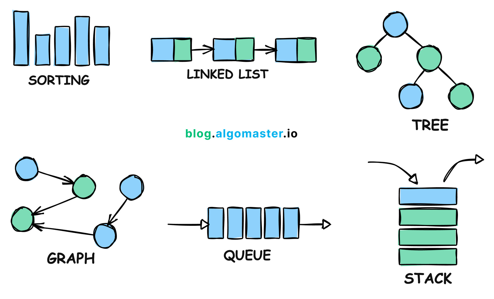

# ✨ Algoritmalar-Veri Yapıları

## Algoritma Nedir?
Bir algoritma, belirli bir problemi çözmek için izlenmesi gereken adımların sıralı bir listesidir. Adım adım talimatlar bütünü olarak düşünebiliriz. Bilgisayarlar, verilen görevleri yerine getirmek için algoritmaları izler.
\
\
**Örneğin,** bir çikolatalı kek yapma tarifi de bir algoritmadır. Malzemeleri karıştırmak, fırını ısıtmak, pişirmek gibi adımları sıralı şekilde takip ederiz. Bilgisayarlarda ise algoritmalar; hesaplamalar yapar, verileri işler ve sonuç üretir.

## Temel Veri Yapıları (Dizi, Liste, Ağaç)
Veri yapıları, verilerin nasıl düzenlendiğini ve saklandığını belirleyen yöntemlerdir. Bilgisayarlar üzerinde verileri düzenli bir şekilde saklayıp gerektiğinde hızlıca erişebilmek için kullanılırlar. İşte temel veri yapıları:

- Dizi (Array): Sabit boyutlu ve aynı tipteki verilerin ardışık bir şekilde saklandığı yapıdır. Örneğin, bir sınıftaki öğrencilerin yaşlarını tutan bir dizi oluşturabilirsiniz: [18, 19, 20, 19].

- Liste (List): Dizilerden farklı olarak listeler, dinamik bir yapıya sahiptir ve eleman ekleyip çıkarabiliriz. Veri türleri aynı olmak zorunda değildir. Bir alışveriş listesi gibi düşünebilirsiniz: ["Ekmek", "Süt", "Peynir"].

- Ağaç (Tree): Ağaç yapısı, bir kök düğümden başlayarak dallara ayrılan ve dalların sonuna kadar dallanabilen bir yapıdır. Örneğin, bir şirketin organizasyon yapısı (genel müdür, müdürler, çalışanlar) bir ağaç olarak temsil edilebilir.

## Arama ve Sıralama Algoritmaları
Bilgisayarların veriyle çalışırken sıkça yaptığı işlemlerden ikisi arama ve sıralamadır.

- Arama Algoritmaları: Bir veri kümesinde istenilen bir veriyi bulmak için kullanılan yöntemlerdir.

- - **Örneğin,** bir arkadaşınızın telefon numarasını bulmaya çalıştığınızı düşünün. Eğer tüm numaralar sıralıysa daha hızlı arama yapabilirsiniz (Binary Search), sıralı değilse sırayla bakmanız gerekebilir (Linear Search).

- Sıralama Algoritmaları: Verileri küçükten büyüğe ya da büyükten küçüğe sıralamak için kullanılan yöntemlerdir.

- - **Örneğin,** sınav sonuçlarını düşükten yükseğe sıralamak istiyorsanız sıralama algoritmaları kullanırsınız (Bubble Sort, Quick Sort gibi).

## Zaman ve Uzay Karmaşıklığı
Algoritmalar çalışırken ne kadar zaman harcadıkları ve ne kadar bellek (uzay) kullandıkları önemlidir.

- Zaman Karmaşıklığı: Bir algoritmanın ne kadar sürede tamamlandığını gösterir. O(n), en yaygın kullanılan notasyondur. n, işlem yapılacak veri sayısını temsil eder. Bir algoritmanın hızını ölçmek için kullanılır.

- - **Örneğin,** 100 kişilik bir listede isim aramak 10 kişilik bir listeden daha uzun sürer.

- Uzay Karmaşıklığı: Bir algoritmanın çalışırken ne kadar bellek kullandığını gösterir. Yine O(n) gibi notasyonlar kullanılarak ifade edilir.

- - **Örneğin,** bir program 100 MB veri saklıyorsa, 1000 MB veri saklayan bir programdan daha az bellek kullanıyordur.

