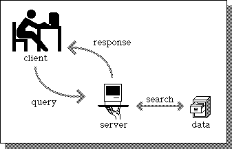

# 👩‍🔧 Backend

## Backend Nedir?
Backend’in Türkçe karşılığı “Arkayüz”dür. Kullanıcıların görmediği arka yüz (Server-side) tarafıdır. Yani sistemin mimarisinin oluşturulduğu, veri tabanı yönetiminin ayarlandığı, sunucu ayarlamalarının yapıldığı, sistemin maksimum seviyede verimli ve hızlı çalışması sağlanan kısımdır.
\
\
**Örneğin**, bir web sitesine kayıt olacağımızı düşünelim. Görmüş olduğumuz kayıt olma arayüzü *Frontend*'dir. Bilgileri girdikten sonra "Kayıt Ol" butonuna bastığımızda girmiş olduğumuz parola *hash* mekanizması sayesinde okunamaz hale gelir ve bu şekilde hem e-posta hem de parola bilgimiz veri tabanına kaydedilir. Eğer başarılı bir şekilde kaydedildiyse Frontend'e bu bilgi gönderilir. Butona bastıktan sonra "Başarılı bir şekilde kayıt oldunuz" veya "Kayıt işlemi başarısız" tarzında bir yazı görene kadar ki geçen süreç Backend'dir. 

## Backend'in Sektördeki Önemi
Backend, uygulamaların güvenilirliği ve verimliliği açısından kritik bir rol oynar. İyi bir backend yapısı, kullanıcı deneyimini doğrudan etkiler ve uygulamanın performansını artırır. Sunucu tarafında veri işleme, güvenlik ve veri bütünlüğü gibi konularla ilgilenir. Yüksek trafikli uygulamalarda ölçeklenebilirlik sağlamak için iyi tasarlanmış bir backend şarttır.

## Backend Nerede Kullanılır?
Backend, çoğu modern uygulamanın temel bileşenidir. Web uygulamalarında, mobil uygulamalarda ve bulut tabanlı hizmetlerde yaygın olarak kullanılır. 
\
\
**Örneğin**, e-ticaret siteleri kullanıcı işlemlerini (sipariş, ödeme) yönetmek için backend sistemlerine ihtiyaç duyar. Sosyal medya platformları ve oyunlar da backend sistemler aracılığıyla kullanıcı verilerini işler ve saklar.

## Backend'de Hangi Diller Kullanılır?

Backend geliştirmede kullanılan yaygın diller arasında şunlar yer alır:

- ⭐ **Java**: Güçlü bir nesne yönelimli dil olup, **Spring Framework** ile yaygın olarak **kurumsal uygulamalarda** tercih edilir. Oldukça güvenli ve çok büyük topluluğa sahip olan bir dildir.
- ⭐ **C#**: Microsoft tarafından geliştirilen bu dil, küçük-orta-büyük ve kurumsal uygulamalarda oldukça popülerdir. **Güçlü kütüphaneleri ve araçları** sayesinde hızlı geliştirme imkanı sunar.
- ⭐ **Go**: Google tarafından geliştirilen Go, yükselen yıldız olarak görülen bir dildir. **Basit sözdizimi ve oldukça yüksek performansı** ile dikkat çeken bir dildir. Goroutine yapısı sayesinde eşzamanlı (concurrent) programlama yapmayı kolaylaştırır. Trendyol gibi büyük şirketlerde kullanılan bir dildir.
- **PHP**: Web geliştirmede klasik bir dildir. **Dünyadaki web sitelerinin yaklaşık %75'i PHP ile geliştirilmiştir** ancak bunun en büyük nedenlerinden birisi WordPress'in PHP tabanlı olmasıdır. Laravel gibi modern framework'ler ile günümüzde hala küçük-orta çaplı projeler için yaygın olarak kullanılmaktadır.
- **Node.js (JavaScript)**: Sunucu tarafında JavaScript çalıştırmaya olanak tanır. Olay tabanlı mimarisi sayesinde yüksek verimlilikle **çok sayıda eşzamanlı isteği** işleyebilir. NPM (Node Package Manager) ile geniş bir paket ekosistemine sahiptir, bu da geliştiricilerin projelerinde hızlıca yeni özellikler eklemelerini sağlar. JSON veri formatını doğal olarak desteklemesi, API geliştirmede büyük avantaj sağlar.

