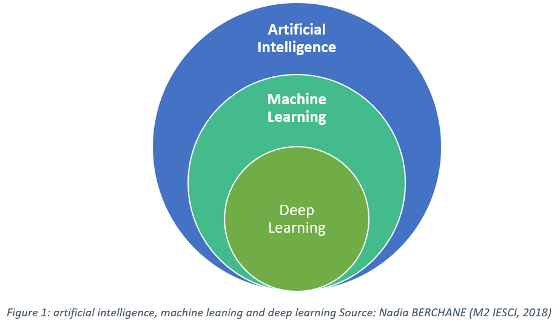

# 🤖 Yapay Zeka
## Yapay Zeka nedir?

Yapay Zeka, bilgisayarların insanlar gibi düşünme, öğrenme ve karar verme yeteneklerini geliştirmeyi amaçlayan bir bilim dalıdır. AI, insan zekasını taklit eden algoritmalar ve modeller ile çeşitli problemleri çözmek için kullanılır. AI sayesinde makineler verileri analiz eder, bu verilerden öğrenir ve sonrasında tahminlerde bulunabilir ya da aksiyon alabilir.

## Yapay Zeka ile Neler Yapılabilir?
Yapay Zeka, günümüzde pek çok alanda devrim yaratmıştır. İşte AI ile yapılabilecek bazı uygulama alanları:

- **Chatbotlar**: Müşteri hizmetleri, soru-cevap sistemleri, sosyal medya etkileşimleri gibi alanlarda kullanılır. Örneğin, bir bankanın web sitesinde karşımıza çıkan ve sorularımıza otomatik cevap veren bir chatbot bir AI uygulamasıdır.
  
- **E-ticaret Öneri Sistemleri**: AI, kullanıcının alışveriş alışkanlıklarını öğrenerek kişiselleştirilmiş ürün önerileri sunabilir. Örneğin, Amazon gibi platformlarda gördüğümüz "Bu ürünü alanlar şunları da aldı" tarzındaki öneriler AI algoritmaları tarafından sağlanır.
  
- **Doğal Dil İşleme (NLP)**: AI, insan dilini anlamak, analiz etmek ve işlemek için kullanılır. Çeviri uygulamaları, metin sınıflandırma, duygu analizi ve hatta metin oluşturma gibi işlevler AI ile mümkündür.
  
- **Görüntü Tanıma**: AI, görüntüleri analiz ederek belirli nesneleri tanıyabilir. Bu teknoloji, yüz tanıma sistemlerinde, sağlık sektöründe MRI gibi tıbbi görüntülerin analizinde veya otonom araçlarda çevreyi algılamak için kullanılır.
  
- **Otonom Sistemler**: AI, sürücüsüz araçlar ve insansız hava araçları (drone'lar) gibi otonom sistemlerde yaygın olarak kullanılır. Bu sistemler çevreyi algılayarak ve analiz ederek, insan müdahalesi olmadan karar verebilirler.
  
- **Sağlık**: AI, tıbbi teşhislerde ve tedavi planlamasında da kullanılır. Örneğin, kanser tarama sistemleri, AI kullanılarak daha yüksek doğrulukla hastalıkları teşhis edebilir.

## AI Öğrenmeye Nereden Başlanır?

Yapay Zeka öğrenmek için en yaygın kullanılan dil **Python**'dır. Python, sahip olduğu geniş kütüphane desteği ve kolay anlaşılabilir yapısı ile AI geliştirmede tercih edilen bir dil olmuştur.

### Yapay Zeka İçin Kullanılan Başlıca Python Kütüphaneleri

- ⭐ **TensorFlow**: Google tarafından geliştirilen ve makine öğrenimi modelleri oluşturmak için kullanılan popüler bir kütüphanedir. Derin öğrenme ve sinir ağları üzerine yoğunlaşır.
  
- ⭐ **Keras**: TensorFlow ve Theano gibi altyapılar üzerine kurulu, kullanımı kolay ve hızlı prototip oluşturmayı sağlayan bir kütüphane.
  
- ⭐ **PyTorch**: Facebook tarafından geliştirilen, özellikle araştırmacılar arasında oldukça popüler olan bir kütüphane. Esneklik ve dinamik hesaplama grafikleri ile bilinir.
  
- ⭐ **scikit-learn**: Denetimli ve denetimsiz makine öğrenimi algoritmalarını içeren bir kütüphane. Basit ve kolay anlaşılır yapısı ile veri bilimi projelerinde sıklıkla kullanılır.
  
- ⭐ **OpenCV**: Bilgisayarla görme (Computer Vision) projelerinde kullanılan popüler bir kütüphane. Görüntü işleme ve nesne tanıma üzerine kapsamlı araçlar sunar.
  
- ⭐ **NLTK ve spaCy**: Doğal dil işleme (NLP) projelerinde kullanılan kütüphanelerdir. Metin verisi üzerinde analiz yapmayı, duygu analizi gerçekleştirmeyi ve dil modelleri oluşturmaya yardımcı olur.

## AI Çeşitleri ve Kullanım Alanları

Yapay Zeka farklı alt alanlarda uzmanlaşabilir. İşte bazı yaygın AI çeşitleri:

- **Makine Öğrenimi (Machine Learning)**: Veriden öğrenme ve model oluşturma üzerine kurulu AI alanıdır. Tahmin, sınıflandırma ve kümeleme gibi görevlerde kullanılır.
  
- **Derin Öğrenme (Deep Learning)**: Sinir ağları ile büyük veri setlerinden öğrenmeye dayalı bir AI türüdür. Özellikle görüntü ve ses tanıma gibi alanlarda etkilidir.
  
- **Doğal Dil İşleme (NLP)**: İnsan dili üzerinde analiz ve işleme yapan AI türüdür. Metin analizi, konuşma tanıma ve metin oluşturma gibi görevlerde kullanılır.
  
- **Yapay Sinir Ağları (Artificial Neural Networks)**: İnsan beyninin çalışma prensiplerinden esinlenerek geliştirilen bu algoritmalar, verilerden öğrenerek karar verebilir.

## AI Öğrenmeye Başlarken İzlenecek Yol Haritası Nasıl Olmalı?
- **Python Programlama Diline Hakim Ol:** Python, AI ve ML dünyasında en çok kullanılan dil olduğu için bu dili iyi öğrenmek kritik önemdedir.
- **Matematiksel Temelleri Öğren (siz bu dersleri alacağınız için şimdilik bunu atlayabilirsiniz):** Lineer cebir, olasılık ve istatistik gibi konular AI algoritmalarını anlamak için gereklidir.
- **Veri Bilimine Giriş:** Veri analizi, veri işleme ve görselleştirme konularında temel bilgi edin.
- **Makine Öğrenmesi (ML) ile Başla:** scikit-learn kullanarak basit algoritmalar (Regresyon, Sınıflandırma) öğren ve projeler yap.
- **Derin Öğrenme (DL) ile İlerlet:** TensorFlow ve Keras kullanarak sinir ağları ve derin öğrenme modelleri geliştir.
- **Projeler Yaparak Deneyim Kazan:** Kendi AI projelerini geliştir, Kaggle gibi platformlardaki veri setleriyle çalış.
- **Etik ve AI Güvenliği:** AI'nın etik boyutlarına ve olası risklerine dikkat et. Algoritmaların adil ve şeffaf olduğundan emin ol.

### Hazır Veri Setlerini Nereden Bulabilirim?

Yapay zeka ve makine öğrenmesi projeleri için kaliteli ve hazır veri setleri bulabileceğiniz birkaç popüler platform:

- **Kaggle**: Veri bilimi ve makine öğrenmesi yarışmalarına ev sahipliği yapan Kaggle, aynı zamanda binlerce ücretsiz veri seti sunar.
  - [Kaggle](https://www.kaggle.com/datasets)

- **UCI Machine Learning Repository**: Makine öğrenmesi araştırmaları için en çok kullanılan platformlardan biridir.
  - [UCI Machine Learning Repository](https://archive.ics.uci.edu/ml/index.php)

- **Google Dataset Search**: Google’ın bu aracı, internet üzerindeki birçok farklı veri kaynağından veri setlerini bulmanıza olanak tanır.
  - [Google Dataset Search](https://datasetsearch.research.google.com/)

- **Data.gov**: ABD hükümeti tarafından sağlanan açık veri platformu.
  - [Data.gov](https://www.data.gov/)

- **Awesome Public Datasets**: GitHub üzerinde topluluk tarafından güncellenen veri setlerinin bulunduğu bir koleksiyon.
  - [Awesome Public Datasets](https://github.com/awesomedata/awesome-public-datasets)

