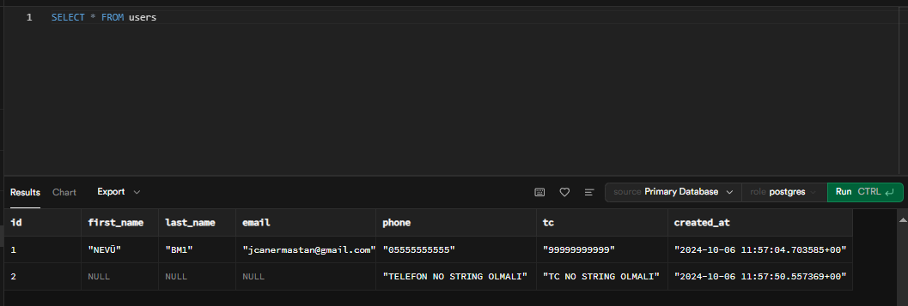

# 💾 Veri Tabanı
## Veri Tabanı Nedir?
Veri tabanı, verilerin düzenli bir şekilde saklandığı, yönetildiği ve erişildiği bir sistemdir. Veri tabanları, uygulamalar için veri depolama ve sorgulama ihtiyaçlarını karşılamak amacıyla kullanılır. Kullanıcılar ve uygulamalar, verileri eklemek, güncellemek, silmek ve sorgulamak için veri tabanlarıyla etkileşimde bulunurlar.

Veri tabanları, genellikle iki ana kategoride sınıflandırılır: SQL (İlişkisel) ve NoSQL (İlişkisel Olmayan). SQL veri tabanları, verileri tablolar halinde saklarken, NoSQL veri tabanları esnek veri modellerine izin verir.

## Veri Tabanlarının Sektördeki Önemi
Veri tabanları, modern uygulamaların temel bileşenleridir. Uygulamaların performansı, veri tabanlarının yapısına ve yönetim şekline bağlıdır. İyi bir veri tabanı tasarımı, verilerin hızlı bir şekilde erişilmesini ve işlenmesini sağlar, bu da kullanıcı deneyimini doğrudan etkiler. Veri tabanları, veri güvenliği, bütünlüğü ve yedeklilik gibi kritik konularda da önemli bir rol oynar.

## Veri Tabanı Nerede Kullanılır?
Veri tabanları, hemen hemen her tür uygulamada kullanılır. Web siteleri, mobil uygulamalar, kurumsal sistemler ve IoT (Nesnelerin İnterneti) çözümleri gibi birçok alanda veri depolamak ve yönetmek için kullanılır.

Örneğin, e-ticaret siteleri ürün bilgilerini, kullanıcı verilerini ve sipariş kayıtlarını yönetmek için veri tabanlarına ihtiyaç duyar. Aynı şekilde sosyal medya platformları, kullanıcı etkileşimlerini ve içerik verilerini saklamak için veri tabanları kullanır.

## Veri Tabanında Hangi Diller ve Teknolojiler Kullanılır?
- SQL (İlişkisel Veri Tabanları)
- - ⭐ **PostgreSQL:** Açık kaynaklı bir ilişkisel veri tabanıdır. Gelişmiş özellikleri (örneğin, JSONB desteği, tam metin arama) ve güçlü veri bütünlüğü sağlama yetenekleri ile bilinir. **Yüksek performansa sahiptir.** SQL standartlarına sıkı sıkıya bağlıdır ve karmaşık sorguların yönetilmesine olanak tanır. Büyük verilerle çalışabilme yeteneği sayesinde, kurumsal düzeyde projelerde yaygın olarak tercih edilir.

- - ⭐ **MySQL:** Açık kaynaklı bir ilişkisel veri tabanıdır ve web tabanlı uygulamalar için yaygın olarak kullanılır. Hızlı sorgulama yetenekleri ve geniş topluluğu sayesinde popülerdir. Genellikle PHP ile birlikte kullanılır ve WordPress gibi birçok içerik yönetim sisteminin temelini oluşturur. Ölçeklenebilirliği ve **kullanım kolaylığı ile hem küçük projelerde hem de büyük sistemlerde tercih edilmektedir.**

- - ⭐ **SQL Server:** **Microsoft tarafından geliştirilen** bu ilişkisel veri tabanı, güçlü iş zekası ve analiz özellikleri sunar. Kurumsal uygulamalar için ideal bir çözüm olan SQL Server, yüksek güvenlik ve performans sunarak büyük veri setleri ile çalışabilir. T-SQL dili ile karmaşık sorgular yazılmasına olanak tanır ve entegre raporlama araçları ile veri analizi süreçlerini kolaylaştırır.

- - ⭐ **SQLite:** **Hafif bir ilişkisel veri tabanıdır** ve genellikle mobil uygulamalarda ve gömülü sistemlerde kullanılır. Tamamen dosya tabanlıdır, bu nedenle uygulama ile birlikte dağıtılabilir. SQLite, hızlı bir kurulum ve düşük kaynak kullanımı gerektirdiği için, geliştirme aşamalarında ve küçük ölçekli projelerde tercih edilmektedir.

- NoSQL (İlişkisel Olmayan Veri Tabanları)
- - ⭐ **MongoDB:** En popüler NoSQL veri tabanlarından biridir. Belgeler halinde veri saklar ve JSON benzeri yapı kullanır. Yüksek performansı ve esnekliği ile dikkat çeker. Verilerin dinamik yapısı sayesinde, uygulama gereksinimlerine göre kolayca genişletilebilir. Özellikle hızlı geliştirme süreçlerinde tercih edilir.

- - ⭐ **Redis:** Genellikle bir önbellekleme çözümü olarak kullanılan bir NoSQL veri tabanıdır. Anahtar-değer yapısında veri saklar ve son derece hızlı veri erişimi sağlar. Veri yapıları üzerinde gerçekleştirilen işlemlerle yüksek performans sunar ve gerçek zamanlı uygulamalar için idealdir.

- - **Cassandra:** Apache tarafından geliştirilen ve yüksek erişilebilirlik ile ölçeklenebilirlik sunan bir NoSQL veri tabanıdır. Veri parçalama ve dağıtılmış mimarisi sayesinde, büyük veri setlerini etkili bir şekilde yönetir. Gerçek zamanlı veri işleme gereksinimi olan uygulamalarda, özellikle yüksek trafikli web sitelerinde sıklıkla kullanılır.

### Örnek bir veri tabanında bulunan "Users" tablosunun kayıtları
