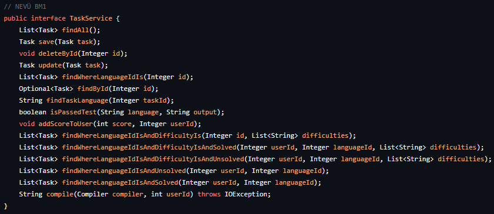

# 🏆 Temiz Kod Yazmak

> "Herhangi bir aptal, bir bilgisayarın anlayabileceği kodlar yazabilir. İyi programcılar, insanların anlayabileceği kodlar yazarlar."
> 
> — Martin Fowler


Kod yazmak, sadece bir problemi çözmekten öte bir sanattır. Her satır, bir ressamın fırça darbeleri gibi düşünülmeli; estetik ve anlam dolu olmalıdır. Temiz ve yapılandırılmış bir kod, okuyucunun zihninde bir hikaye oluşturur ve yazılımcının yaratıcılığını yansıtır. Tıpkı bir sanat eserinin her detayının özenle düşünülmesi gerektiği gibi, iyi bir kod da dikkatle planlanmalı ve titizlikle yazılmalıdır.

## Temiz kod nedir?

Temiz kod, anlaşılması, bakımı ve genişletilmesi kolay olan koddur. Bu kodun amacı, hem diğer yazılımcılar hem de kendiniz için kodu daha anlaşılır ve düzenli hale getirmektir. Kısa, öz ve gereksiz karmaşıklıktan uzak kodlar yazmak temiz kodun temelidir.

## Temiz kod yazmak neden önemlidir?

- **Bakım kolaylığı sağlar**: İyi yazılmış kod, zamanla büyüdüğünde bile daha kolay bir şekilde yönetilir ve üzerinde çalışılır.
- **Takım çalışmasına uygundur**: Temiz kod, takım arkadaşlarınızın koda hızlıca adapte olmasını ve anlamasını sağlar.
- **Hata bulmayı kolaylaştırır**: Anlaşılır kod, hataların daha kolay bulunmasını ve düzeltilmesini sağlar.
- **Uzun ömürlü projelere katkı sağlar**: Projeniz üzerinde yıllar sonra bile çalışacak birileri, yazdığınız temiz kod sayesinde daha az zaman harcar ve daha verimli çalışabilir.

## Temiz kod yazmanın temel prensipleri nelerdir?

### 1. Anlamlı ve Anlaşılır İsimler Kullanın
Değişken, fonksiyon ve sınıf isimleri, ne yaptıklarını açıkça ifade etmelidir. Kısaltmalardan ve belirsiz isimlendirmelerden kaçının.
- İyi bir isim: `calculateTotalPrice()`
- Kötü bir isim: `calcTP()` veya `ctp()`

##### Peki ya fonksiyonumuzun veya değişkenimizin ismi çok uzun olursa?
Aslında amacımız mümkün olduğunca kısa isim vermek. Sizin kodunuzda anlamlı olan en kısa isim bile uzun gözüküyorsa bu bir sorun teşkil etmez. Yeter ki kodunuz anlaşılır olsun :)
\
\

\
Burada bulunan fonksiyon isimlerini okuyunca ne iş yaptığını anlamayan var mı?
Eğer anlamayan varsa ben de kötü yazmışım demektir 😥.

### 2. Fonksiyonlar Küçük ve Tek Sorumluluğa Sahip Olmalı
Fonksiyonlar tek bir iş yapmalı ve kısa tutulmalıdır. Bir fonksiyon ne kadar kısa ve odaklıysa, o kadar temizdir.
#### Kötü Örnek
```c
void calculateTotalAndPrintInfo(float prices[], int quantities[], int size) { // hem hesaplama yapar hem de ekrana yazdırır
    float total = 0;
    for (int i = 0; i < size; i++) {
        total += prices[i] * quantities[i];
    }
    printf("Toplam Fiyat: %.2f\n", total);
}
```

#### İyi Örnek
```c
float calculateTotal(float prices[], int quantities[], int size) { // hesaplama yapar
    float total = 0;
    for (int i = 0; i < size; i++) {
        total += prices[i] * quantities[i];
    }
    return total;
}

void displaySummary(float total, int itemCount) { // ekrana yazdırır
    printf("Toplam Ürün Sayısı: %d\n", itemCount);
    printf("Toplam Fiyat: %.2f TL\n", total);
}
```

### 3. Yorum Satırlarını Azaltın, Kodu Kendini Anlatacak Şekilde Yazın
Öyle bir kod yazın ki, yorum eklemenize gerek kalmasın. İyi isimlendirme ve yapı sayesinde kod kendi kendini açıklar.
- İyi: Anlamlı fonksiyon ve değişken isimleri kullanarak yorumları azaltmak.
- Kötü: Karmaşık kodun ne yaptığını açıklayan çok fazla yorum.

Sizce aşağıdaki fotoğrafta yorum satırına ihtiyaç duyulan bir yer var mı? 
\


### 4. Tekrar Etmeyin (DRY - Don't Repeat Yourself)
Kodunuzu tekrar yazmaktan kaçının. Aynı işi tekrar tekrar yapan kod bloklarını ortak bir fonksiyon veya yapı haline getirin.
- İyi: Tekrarlayan kodları fonksiyonlara ayırmak.
- Kötü: Aynı kodu birden fazla yerde tekrar etmek.

### 5. Kodunuzu Düzenli Hale Getirin (Yapısal Temizlik)
- **Indentation**: Kodu doğru bir şekilde girintileyin. İyi bir yapı, kodun okunabilirliğini artırır.
- **Boşluklar**: Kodunuzda önemli kısımlar arasında boşluklar bırakın, bu kodu daha okunabilir hale getirir.
Günümüzde artık hepimiz IDE veya Kod Editörü kullanıyoruz. Bu programlarda "format" özelliği mevcut ve kodumuzu kendisi düzenli hale getirebiliyor. Kendi IDE'niz veya kod editörünüzde bu ayarın nasıl yapıldığını araştırabilirsiniz (Visual Studio Code kullanıyorsanız dile göre eklenti gerekebilir).

### 6. CamelCase ve snake_case Kullanımı
Değişken ve fonksiyon isimlerinde yaygın standartları takip edin:
- **camelCase**: JavaScript, Java, C# gibi dillerde değişken ve fonksiyon isimleri için yaygındır. Örnek: `calculateTotalPrice`
- **snake_case**: Python gibi dillerde tercih edilir. Örnek: `calculate_total_price`
Dolayısıyla Python dilinde geliştirme yaparken snake_case, C# dilinde geliştirme yaparken camelCase tercih etmelisiniz.
Sınıf (Class) isimlerinde de çoğunlukla PascalCase tercih edilir. 

## SOLID Prensipleri Nedir?

SOLID, temiz ve sürdürülebilir kod yazmak için beş ana prensibi kapsayan bir kısaltmadır:

### ⭐ 1. Single Responsibility Principle (SRP - Tek Sorumluluk Prensibi)
Her sınıfın veya fonksiyonun sadece bir sorumluluğu olmalıdır. Çok fazla işi tek bir sınıf veya fonksiyon yüklenmemelidir.
- İyi: `Invoice` sınıfı yalnızca faturayı yönetir.
- Kötü: `Invoice` sınıfı hem fatura hem de vergi hesaplamaları yapar.

### ⭐ 2. Open/Closed Principle (Açık/Kapalı Prensibi)
Bir sınıf veya fonksiyon genişletmeye açık olmalı ama değişime kapalı olmalıdır. Yani mevcut kodu değiştirmek yerine, yeni işlevler ekleyebilmelisiniz.
- İyi: Eski fonksiyonlarınızı bozmadan yeni işlevler ekleyin.
- Kötü: Mevcut kodu sürekli değiştirerek sistemi bozma riski yaratmak.

### 3. Liskov Substitution Principle (Liskov'un Yerine Geçme Prensibi)
***(Bu kısım karmaşık gelebilir bu yüzden yıldızlanmadı fakat önemi büyük.)***
\
Türemiş sınıflar, base sınıflarının yerine kullanılabilmelidir. Yani bir alt sınıf, üst sınıfın tüm işlevlerini bozmayacak şekilde genişletmelidir.
- İyi: Alt sınıfların üst sınıfın özelliklerini bozmadan genişletmesi.
- Kötü: Alt sınıfın, üst sınıfın işleyişini bozması.

### ⭐ 4. Interface Segregation Principle (Arayüz Ayrım Prensibi)
*(Nesne Yönelimli Programlama dersinden sonra bu kısım daha iyi anlaşılır)*
\
Büyük arayüzler yerine, daha spesifik ve küçük arayüzler tasarlayın. Kullanılmayan özelliklerin zorunlu hale gelmesini önleyin.
- İyi: Birden fazla küçük, işlevsel arayüzler oluşturmak.
- Kötü: Tüm sınıfları büyük bir arayüz ile çalışmaya zorlamak.

### ⭐ 5. Dependency Inversion Principle (Bağımlılıkları Tersine Çevirme Prensibi)
Üst seviye modüller, alt seviye modüllere bağımlı olmamalıdır. İkisi de soyut bir arayüze bağlı olmalıdır.
- İyi: Bağımlılıkları soyutlama aracılığıyla yönetmek.
- Kötü: Üst seviye modüllerin doğrudan alt seviye modüllere bağımlı olması.

## SOLID Dışında Bazı Prensipler
### YAGNI (You Aren't Gonna Need It)
Bu prensip, mevcut ihtiyaçlara göre kod yazmayı ve gereksiz özellikler eklemekten kaçınmayı önerir. Gelecekte ihtiyaç duyulacak özellikler için önceden yazmak, kodu karmaşık hale getirebilir ve bakımını zorlaştırabilir.
\
\
Kullanılmayacak özellikler eklemek yerine, yalnızca mevcut işlevselliğe odaklanmak daha etkilidir.

### DRY (Don't Repeat Yourself)
Bu prensip, aynı kodun tekrar edilmesinden kaçınılması gerektiğini belirtir. Tekrar eden kod, hatalara yol açabilir ve bakım sürecini zorlaştırır. Bunun yerine, kodun yeniden kullanılabilirliğini artırmak için fonksiyonlar veya sınıflar oluşturulmalıdır.
\
\
Benzer işlevselliğe sahip kod parçaları, ortak bir fonksiyon haline getirilmeli ve gerektiğinde çağrılmalıdır.

### KISS (Keep It Simple, Stupid)
Bu ilke, yazılımın mümkün olduğunca basit tutulması gerektiğini vurgular. Karmaşık çözümler yerine, basit ve anlaşılır çözümler tercih edilmelidir.
\
\
Karmaşık algoritmalar yerine, daha basit ve daha az hata riski taşıyan yöntemler kullanılmalıdır.

### Avoid Side Effects
Fonksiyonlar yan etkiler oluşturmamalıdır; yani, bir fonksiyon çağrıldığında global durumu değiştirmemelidir. Bu, kodun test edilmesini ve anlaşılmasını zorlaştırabilir.
\
\
Fonksiyonlar yalnızca girdi parametrelerini kullanarak çıktılar üretmeli ve dış durumu değiştirmemelidir.

## Detaya İnmek
Yukarıda yazan teknikler her yerde rahatlıkla bulabileceğiniz artık sıradanlaşmış tekniklerdi. Bu işe daha fazla kafa yormak isteyenler için birkaç teknik daha ekleyeceğim.
\
Eğer sizin de bulduğunuz teknik varsa lütfen bana da söyleyin 😊.

#### 1- Olumlu İfadelerle Başlamak
`if` ifadelerinde "!" yani NOT ile başlamak tavsiye edilmez. "!" operatörü, ifadeyi olumsuz hale getirir ve bu da kodun akışını zorlaştırabilir. Örneğin, if (!isAvailable) ifadesi, kodu okuyan birinin düşünmesini gerektirir.

##### Kötü Örnek
```c
if (!isUserActive) {
    // Kullanıcı aktif değilse yapılacak işlemler
}
```
##### İyi Örnek
```c
if (isUserInactive) {
    // Kullanıcı aktif değilse yapılacak işlemler
}
```
#### 2- Magic Numbers Kullanımından Kaçınma
Sayılar doğrudan kodda kullanılmamalıdır. Bunun yerine, anlamlı sabitler veya enum'lar kullanılmalıdır.
#### Kötü Örnek
```c
if (age > 18) {
    // ...
}
```
#### İyi Örnek
```c
const int legalAge = 18;
if (age > legalAge) {
    // ...
}
```
Aslında, "İyi Örnek" kısmındaki kodda temiz kod açısından ufak bir eksik var.

```c
const int LEGAL_AGE = 18;
if (age > LEGAL_AGE) {
    // ...
}
```
Sabit ifadeler ALL_CAPS şeklinde yazılır :)

#### 3- Guard Clauses
Guard Clauses, özellikle karmaşık ve derin if yapılarının önüne geçmek için kullanılır. Bu teknik, bir fonksiyonun veya metodun başında belirli koşulların doğrulanıp doğrulanmadığını kontrol eder. 
\
Kod üzerinden örneğimize bakalım (JavaScript).

```javascript
if (user.age != null) {
    if (user.age! >= 18) {
        return 'Adult';
    } else {
        return 'Child';
    }
} else {
    return 'No Age';
}
```
Sizce bu kodu okuması kolay mı? Muhtemelen birçoğunuz kolay demiştir.
\
\
Peki kodu bu şekilde yazsaydık?
```javascript
if (user.age == null ) {
    return 'No Age';
}
if (user.age! < 18) {
    return 'Child';
} 
return 'Adult';
```
Sizce de daha okunaklı değil mi? Bu iki kod bloğu da aynı işi yapıyordu ancak kodu anlama süresi bakımından ciddi farklar mevcut.

## Özet

Temiz kod yazmak, yazılım geliştirme sürecinde hem size hem de takım arkadaşlarınıza büyük bir avantaj sağlar. Anlaşılır, bakımı kolay ve genişletilebilir kod yazmanın temeli doğru isimlendirme, yapılandırma ve bazı temel prensipleri takip etmektir. **SOLID prensipleri** de bu konuda rehberlik eder ve yazılım kalitesini artırmaya yardımcı olur. **Unutmayın, temiz kod yazmak bir alışkanlık işidir ve zamanla daha iyi olursunuz!**
